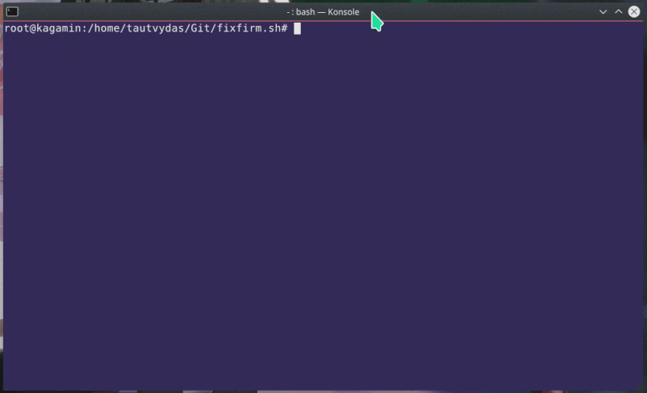
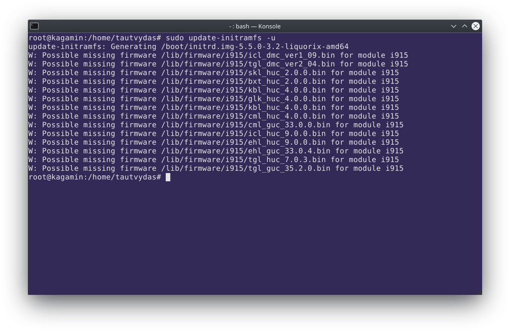

# fixfirm.sh

## About

Observes missing firmware in different firmware modules and tries to fix issues that come from them by fetching the most recent and pre-existing firmware binary modules from the upstream Linux firmware git repository.

### The process behing the script

1.   Issues `update-initramfs -u` and collects infromation about missing firmware
2.   Clones `git://git.kernel.org/pub/scm/linux/kernel/git/firmware/linux-firmware.git`
3.   Finds relevant missing binary modules and copies them to `/lib/firmware/`
4.   Runs `update-initramfs -u` once again to update an initramfs image

### Usage

| Argument            | Meaning                                                      |
| ------------------- | ------------------------------------------------------------ |
| `-h` or `--help`    | Display the usage window and exit                            |
| `-m` or `--missing` | Print missing firmware modules and exit                      |
| `-k` or `--keep`    | Keep the cloned/fetched Linux firmware git repository from deletion (useful if you don't want to download 1 GB of data each time you run the script) |

for instance, by typing `bash fixfirm.sh --help` it will display the usage window.

### Why was this needed?

As a matter of fact, I'm a regular user of the Liquorix kernel on Debian Sid, and whenever I update the kernel to a newer version, I face the following warning messages past the kernel compilation process:

It shows that the Intel i915 chip lacks some firmware, even though I have already installed the package `xserver-xorg-video-intel` that supports the Intel i9xx family chipset. Since fixing the same issues by hand all over again on different Linux powered machines has become cumbersome, I came up with this project idea to help me automate the system administration of Linux home servers.

## License

This project is available under the Unlicense License. See the LICENSE file for more info.
